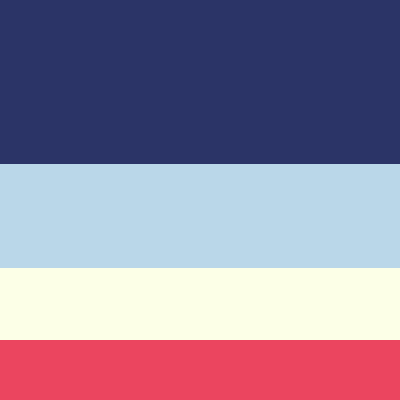

# Movie Tracker Library
A virtual library app. It is a part of Brainnest Advanced Frontend Software Development Training. This was made using HTML, CSS and Javascript without any frameworks.

- The app is hosted on Github Pages. You can access it [here](https://jtm2021.github.io/Movie-Tracker-Library/).
- The repository can be found [here](https://github.com/jtm2021/Movie-Tracker-Library).

## Wireframes
The wireframes for this project were created using [Figma](https://canva.com).

Click To See Desktop Wireframe

Click To See Tablets Wireframe

Click To See Phones Wireframe

## Typography
This project used an external font from [Google Fonts](https://fonts.google.com/). The fonts used are Caster One and Montserrat.

## Color Scheme
The color scheme used in this project was created using Crika color palette from [Colorhunt.co](https://colorhunt.co/palette/2b3467bad7e9fcffe7eb455f).

## Images & Icons
Icons were downloaded from [Material Design Icons](https://materialdesignicons.com/). Images were downloaded from [IMDB](https://imdb.com) and various sources. The logos were downloaded from [Simple Icons](https://simpleicons.org/).
